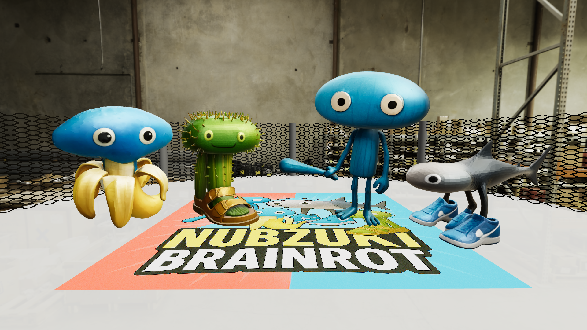

# 3D Rendering Contest



Demo : https://sy-hwang.github.io/nubzuki-brainrot/

## How to run locally

1. Open your terminal and move to the project directory.

```bash
cd path/to/your/project
```

2. Start a simple HTTP server using Python:

```bash
python3 -m http.server 8000
```

3. Open your web browser and go to:

```
http://localhost:8000
```

